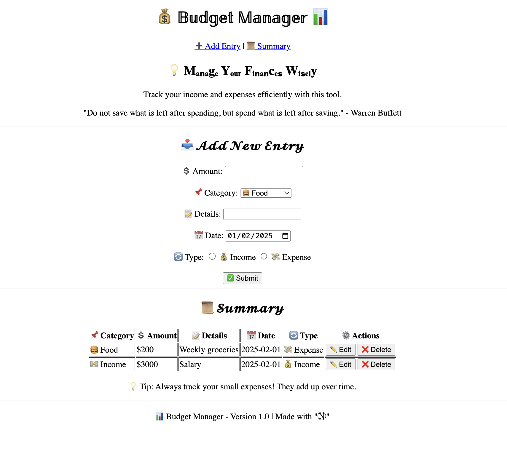

# ** 💰 BUDGET MANAGER📊  **  
## ------ (HTML) Part: Assignment 1 📝 -------



## 📌 **Project Overview**  
This project is part of my internship at **Innomatics Research Labs**. For my initial assignment, I developed a basic **Smart Budgeting and Finance Tracker** using **HTML**. The tool enables users to efficiently track their income 💸 and expenses 💳 by adding transactions and viewing a simple summary.

## 🛠️ **Technologies Used**  
- **HTML**: Used to structure and design the layout of the webpage.

## 🔑 **Key Features**  
- **Add Transactions** 📝: Users can log both income and expense transactions.  
- **View Summary** 📅: Displays a table that summarizes recorded transactions, including details like amount 💲, category 📌, and date 📅.  
- **User-Friendly Layout** 🖥️: A simple and clean interface for easy navigation between transaction entry and summary viewing.

## 💡 **Project Objective**  
The primary goal of this project was to gain an understanding of how to structure a webpage using HTML, create user input forms 🖊️, and organize content effectively for tracking personal financial data 💼.

## 📂 **Project Structure**  
```bash
/
├── html_code.html       # Main HTML file of the project
├── Results
│   └── Html_result.png  # (Optional) Screenshot of the project
├── README.md            # Project documentation
